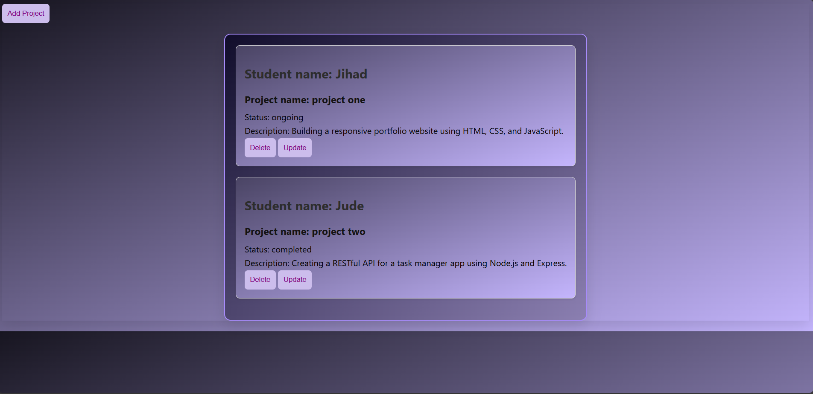
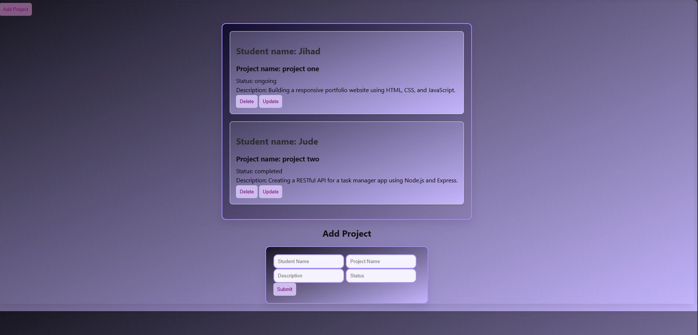
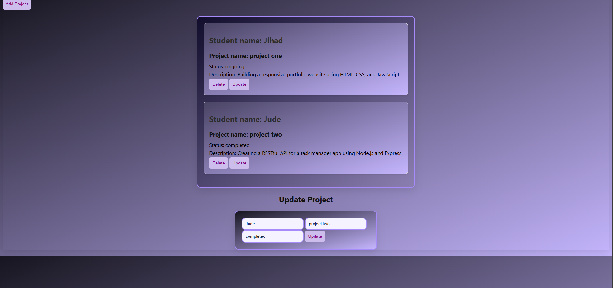
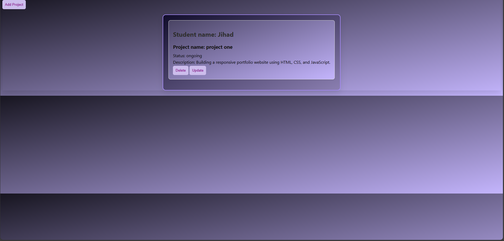

# 🚀 Bootcamp Project Tracker

A responsive web application to track student projects during a coding bootcamp. Built with **HTML**, **CSS**, **JavaScript**, and **Node.js/Express** for seamless frontend-backend integration.

---

## 📸 UI Behavior


### ➕ Add Project

_When "Add Project" is clicked, a form appears allowing users to input project details._

### ✏️ Update Project

_Clicking "Update" opens a form to modify existing project information._

### 🗑️ Delete Project

_Clicking "Delete" removes the selected project card from the tracker._

---

## 🧰 Tech Stack

- **Frontend**: HTML, CSS, JavaScript
- **Backend**: Node.js, Express
- **UI Features**:
  - Modal popups for form interactions
  - Gradient themes with purple/blue palette
  - Responsive layout and clean design

---

## 📂 Features

- Add new student projects with name, status, and description
- Update existing project details
- Delete projects dynamically
- Real-time UI updates with backend connectivity

---

## 🛠️ How to Run Locally

1. Clone the repository:
   ```bash
   git clonehttps://github.com/MaryaTawfik/project-tracker.git
   cd project-tracker
Install backend dependencies:

bash
cd backend
npm install
Start the backend server:

bash
node index.js
Open the frontend:

Navigate to frontend/index.html in your browser

🌐 Live Demo
Coming soon...

🙋‍♀️ Author
Marya — Passionate about building polished, user-friendly web apps with modern UI/UX.

📬 Contact & Networking
GitHub: MaryaTawfik

